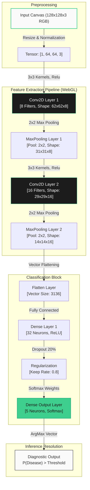
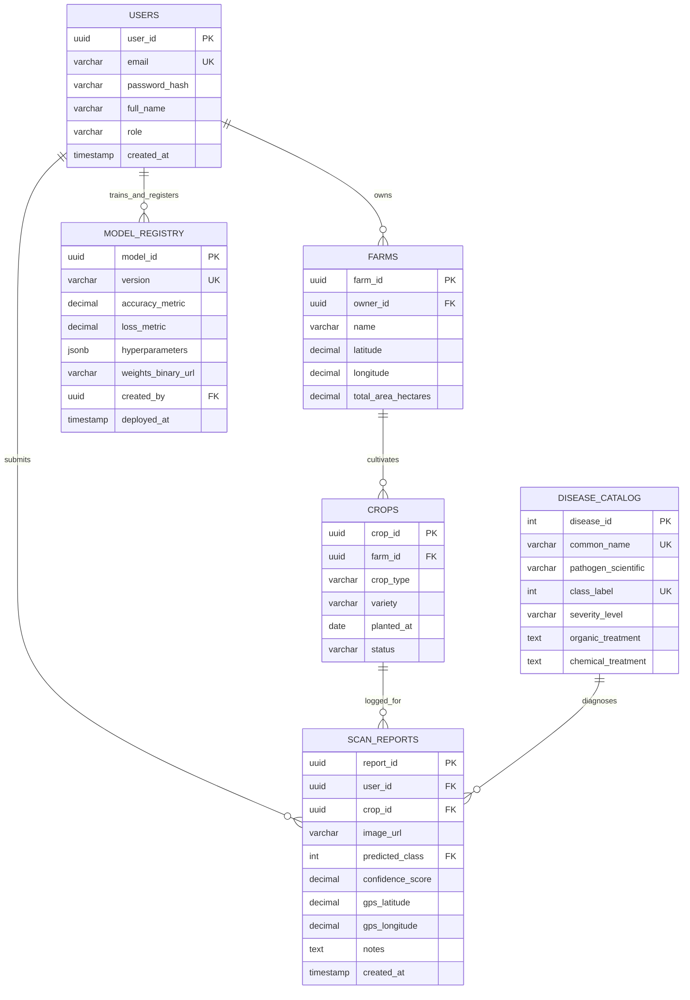

# Comprehensive System Documentation & Diagrams: AgriCNN

AgriCNN is an advanced serverless, in-browser agricultural deep-learning computer vision platform. This document serves as the complete technical specification, visual system blueprints, database designs, and functional diagrams for scaling the platform from a client-side workbench into an enterprise-grade production architecture.

---

## 1. System Overview & Vision

AgriCNN bridges precision agriculture and client-side machine learning. By utilizing WebGL-accelerated model compilation in the browser, it allows farmers, agronomists, and researchers to instantly diagnose crop leaf diseases offline, maintaining absolute data privacy and eliminating network latencies.

### Key Visual Specs (Supabase Design Guidelines)
- **Primary Color (Emerald)**: `#3ecf8e` - Used exclusively for primary calls-to-action and indicators to establish high visual intent.
- **Surface Canvas**: `#ffffff` - Pure white backgrounds to convey clarity and simplicity.
- **Contrast Canvas (Night)**: `#1c1c1c` - Deep near-black cells reserved for mathematical widgets, code listings, and WebGL shader displays.
- **Typography Scale**: Clean geometric sans-serif (Inter/Circular) running at weight 500 for display layers with tight tracking (`letter-spacing: -0.03em`).

---

## 2. Use Case Diagram

The use case diagram below details the operational boundaries of the AgriCNN platform and how three distinct user personas (Farmers, AI Students, and Guest Users) interact with the functional subsystems.

```mermaid
rect -- "Use Case Boundaries"
  graph LR
    subgraph "AgriCNN System Core"
      UC1["Upload Leaf Photo"]
      UC2["Scan Leaf Preset"]
      UC3["Inspect Visual Feature Maps"]
      UC4["Read Diagnosis & Guidelines"]
      UC5["Adjust Hyperparameters"]
      UC6["Train Custom Model Live"]
      UC7["Browse Pathogen Catalog"]
      UC8["Export Diagnostics Report"]
    end

    Farmer["Farmer / Agronomist"] --> UC1
    Farmer --> UC4
    Farmer --> UC8
    Farmer --> UC7

    Student["AI Research Student"] --> UC2
    Student --> UC3
    Student --> UC5
    Student --> UC6
    Student --> UC7

    Guest["Guest User"] --> UC2
    Guest --> UC4
    Guest --> UC7
```

---

## 3. Network Architecture Diagram

The Convolutional Neural Network (CNN) is structured sequentially in 7 layers. The diagram below tracks the tensor dimensions, kernel operations, and parameter pools as pixel values transition from a raw leaf photo into a disease probability distribution.



---

## 4. Production Database Schema (SQL DDL)

To scale AgriCNN into a cloud-integrated production ecosystem, we require a highly normalized relational database to manage user profiles, farms, sensor reports, image files, and model versioning histories. Below is the optimized PostgreSQL DDL schema:

```sql
-- 1. Users Table
CREATE TABLE users (
    user_id UUID PRIMARY KEY DEFAULT gen_random_uuid(),
    email VARCHAR(255) UNIQUE NOT NULL,
    password_hash VARCHAR(255) NOT NULL,
    full_name VARCHAR(100) NOT NULL,
    role VARCHAR(30) CHECK (role IN ('Farmer', 'Agronomist', 'Researcher', 'Admin')) DEFAULT 'Farmer',
    created_at TIMESTAMP WITH TIME ZONE DEFAULT CURRENT_TIMESTAMP,
    updated_at TIMESTAMP WITH TIME ZONE DEFAULT CURRENT_TIMESTAMP
);

-- 2. Farms Table
CREATE TABLE farms (
    farm_id UUID PRIMARY KEY DEFAULT gen_random_uuid(),
    owner_id UUID NOT NULL REFERENCES users(user_id) ON DELETE CASCADE,
    name VARCHAR(150) NOT NULL,
    latitude DECIMAL(9,6),
    longitude DECIMAL(9,6),
    total_area_hectares DECIMAL(10,2),
    created_at TIMESTAMP WITH TIME ZONE DEFAULT CURRENT_TIMESTAMP
);

-- 3. Crops Table
CREATE TABLE crops (
    crop_id UUID PRIMARY KEY DEFAULT gen_random_uuid(),
    farm_id UUID NOT NULL REFERENCES farms(farm_id) ON DELETE CASCADE,
    crop_type VARCHAR(100) NOT NULL CHECK (crop_type IN ('Tomato', 'Corn', 'Apple', 'Grape', 'Other')),
    variety VARCHAR(100),
    planted_at DATE,
    status VARCHAR(50) DEFAULT 'Active'
);

-- 4. Disease Catalog Table
CREATE TABLE disease_catalog (
    disease_id SERIAL PRIMARY KEY,
    common_name VARCHAR(150) UNIQUE NOT NULL,
    pathogen_scientific VARCHAR(150) NOT NULL,
    class_label INT UNIQUE NOT NULL, -- Corresponds to CNN outputs [0-4]
    severity_level VARCHAR(30) CHECK (severity_level IN ('Low', 'Medium', 'High', 'Critical')),
    organic_treatment TEXT NOT NULL,
    chemical_treatment TEXT NOT NULL
);

-- 5. Scan Reports Table
CREATE TABLE scan_reports (
    report_id UUID PRIMARY KEY DEFAULT gen_random_uuid(),
    user_id UUID REFERENCES users(user_id) ON DELETE SET NULL,
    crop_id UUID REFERENCES crops(crop_id) ON DELETE CASCADE,
    image_url VARCHAR(512) NOT NULL,
    predicted_class INT NOT NULL REFERENCES disease_catalog(class_label),
    confidence_score DECIMAL(5,2) NOT NULL CHECK (confidence_score BETWEEN 0.00 AND 100.00),
    gps_latitude DECIMAL(9,6),
    gps_longitude DECIMAL(9,6),
    notes TEXT,
    created_at TIMESTAMP WITH TIME ZONE DEFAULT CURRENT_TIMESTAMP
);

-- 6. Model Registry Table
CREATE TABLE model_registry (
    model_id UUID PRIMARY KEY DEFAULT gen_random_uuid(),
    version VARCHAR(30) UNIQUE NOT NULL,
    accuracy_metric DECIMAL(5,2) NOT NULL,
    loss_metric DECIMAL(6,4) NOT NULL,
    hyperparameters JSONB NOT NULL, -- Stores Epochs, LR, and Batch configs
    weights_binary_url VARCHAR(512) NOT NULL,
    created_by UUID REFERENCES users(user_id),
    deployed_at TIMESTAMP WITH TIME ZONE DEFAULT CURRENT_TIMESTAMP
);
```

---

## 5. Entity Relationship Diagram (ERD)

The Entity Relationship Diagram below details how data models relate to each other, mapping cardinality limits and primary/foreign key connections.



---

## 6. Verification & System Extension Guides

> [!TIP]
> **Connecting the Frontend to the PostgreSQL Backend:**
> When migrating AgriCNN from a client-only sandbox into this production environment:
> 1. Create a RESTful or GraphQL API endpoint using Node.js (Express) or Python (FastAPI).
> 2. On upload, standard base64 files from `app.js` can be uploaded to an Amazon S3 bucket, returning an `image_url` to be logged into `scan_reports`.
> 3. Save trained weights from in-browser learning dashboards directly using `await STATE.model.save('http://api.agricnn.com/model/upload')` to store the weight matrix in the model registry.
